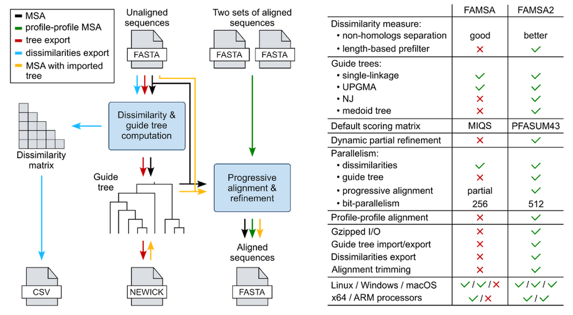

# FAMSA2

[](https://github.com/refresh-bio/FAMSA/releases)
[](https://anaconda.org/bioconda/famsa)
[](https://biocontainers.pro/tools/famsa)
[](../../actions/workflows/main.yml)
[](https://www.gnu.org/licenses/gpl-3.0) [](https://gitter.im/refresh-bio/FAMSA?utm_source=badge&utm_medium=badge&utm_campaign=pr-badge&utm_content=badge)


[](https://pypi.org/project/pyfamsa)

FAMSA2 is a progressive algorithm for large-scale multiple sequence alignments:
* the entire Pfam-A v37.0 (~22 thousand families, ~62 million sequences) was analyzed in 8 hours,	
* the family PF00005 of 3 million ABC transporters was aligned in 5 minutes and 18 GB of RAM.

## Overview and features



## Quick start

```bash
git clone https://github.com/refresh-bio/FAMSA --recursive
cd FAMSA && make

# align sequences with default parameters (single linkage tree)
./famsa ./test/adeno_fiber/adeno_fiber sl.aln

# align sequences using UPGMA tree with 8 computing threads, store the result in a gzip archive
./famsa -gt upgma -t 8 -gz ./test/adeno_fiber/adeno_fiber upgma.aln.gz

# export a neighbour joining guide tree to the Newick format
./famsa -gt nj -gt_export ./test/adeno_fiber/adeno_fiber nj.dnd

# align sequences with the previously generated guide tree
./famsa -gt import nj.dnd ./test/adeno_fiber/adeno_fiber nj.aln

# align sequences with an approximated medoid guide tree and UPGMA subtrees
./famsa -medoidtree -gt upgma ./test/hemopexin/hemopexin upgma.medoid.aln

# export a distance matrix to the CSV format (lower triangular) 
./famsa -dist_export ./test/adeno_fiber/adeno_fiber dist.csv

# export a pairwise identity (PID) matrix to the CSV format (square) 
./famsa -dist_export -pid -square_matrix ./test/adeno_fiber/adeno_fiber pid.csv

# profile-profile alignment without refining output 
./famsa -refine_mode off ./test/adeno_fiber/upgma.no_refine.part1.fasta ./test/adeno_fiber/upgma.no_refine.part2.fasta pp.fasta
```


## Installation and configuration

FAMSA comes with a set of [precompiled binaries](https://github.com/refresh-bio/FAMSA/releases) for Windows, Linux, and macOS. They can be found under Releases tab. 
The software is also available on [Bioconda](https://anaconda.org/bioconda/famsa):
```
conda install -c bioconda famsa
```
For detailed instructions how to set up Bioconda, please refer to the [Bioconda manual](https://bioconda.github.io/user/install.html#install-conda). 
A user-friendly [PyFAMSA](https://github.com/althonos/pyfamsa) module authored by [Martin Larralde](https://github.com/althonos/) allows running analyzes directly from Python.
Finally, FAMSA can be built from the sources distributed as:

* Visual Studio 2022 solution for Windows,
* GNU Make project for Linux and macOS (gmake 4.3 and gcc/g++ 11 or newer required).

FAMSA can be built for x86-64 and ARM64 8 architectures (including Apple M1 based on ARM64 8.4 core) and takes advantage of AVX2 (x86-64) and NEON (ARM) CPU extensions. The default target platform is x86-64 with AVX2 extensions. This, however, can be changed by setting `PLATFORM` variable for `make`:

```bash
gmake PLATFORM=none    # unspecified platform, no extensions
gmake PLATFORM=sse4    # x86-64 with SSE4.1 
gmake PLATFORM=avx     # x86-64 with AVX 
gmake PLATFORM=avx2    # x86-64 with AVX2 (default)
gmake PLATFORM=avx512  # x86-64 with AVX512 
gmake PLATFORM=native  # x86-64 with native architecture
gmake PLATFORM=arm8    # ARM64 8 with NEON  
gmake PLATFORM=m1      # ARM64 8.4 (especially Apple M1) with NEON 
```   

Note, that x86-64 binaries determine the supported extensions at runtime, which makes them backwards-compatible. For instance, the AVX executable will also work on SSE-only platform, but with limited performance. An additional `make` option can be used to force static linking (may be helpful when binary portability is desired): `make STATIC_LINK=true`

The latest speed improvements in FAMSA limited the usefullness of the GPU mode. Thus, starting from the 1.5.0 version, there is no support of GPU in FAMSA. If maximum throughput is required, we encourage using new medoid trees feature (`-medoidtree` switch) which allows processing gigantic data sets in short time (e.g., the familiy of 3 million ABC transporters was analyzed in five minutes). 


## Usage

`famsa [options] <input_file> [<input_file_2>] <output_file>`

Positional parameters:
* `input_file`, `input_file_2` - input files in FASTA format (optionally gzipped); first input can be replaced with STDIN string to read from standard input; action depends on the number of input files:
    * one input - multiple sequence alignment (input gaps, if present, are removed prior the alignment),
    * two inputs - profile-profile aligment (gaps are preserved).
* `output_file` - output file (pass STDOUT when writing to standard output); available outputs:
    * alignment in FASTA format,
    * guide tree in Newick format (`-gt_export` option specified),
	* distance matrix in CSV format (`-dist_export` option specified).

Options:
* `-help` - show advanced options
* `-t <value>` - no. of threads, NOTE: exceeding number of physical (not logical) cores decreases performance, 0 indicates half of all the logical cores (default: 0)
* `-v` - verbose mode, show timing information (default: disabled)

* `-gt <sl | upgma | nj | import <file>>` - the guide tree method (default: sl):
    * `sl` - single linkage,
    * `upgma` - UPGMA,
    * `nj` - neighbour joining,
    * `import <file>` - import from a Newick file.
* `-medoidtree` - use medoid tree for fast approximated guide trees (default: disabled)
* `-gt_export` - export a guide tree to output file in the Newick format
* `-dist_export` - export a distance matrix to output file in CSV format
* `-square_matrix` - generate a square distance matrix instead of a default triangle
* `-pid` - calculate percent identity (the number of matching residues divided by the shorter sequence length) instead of distance
* `-keep_duplicates` - keep duplicated sequences during alignment (default: disabled - duplicates are removed prior and restored after the alignment)
* `-gz` - enable gzipped output (default: disabled)
* `-gz_lev <value>` - gzip compression level [0-9] (default: 7)
* `-trim_columns <fraction>` - remove columns with less than `fraction` of non-gap characters
* `-refine_mode <on | off | auto>` - refinement mode (default: `auto` - the refinement is enabled for sets <= 1000 seq.)


### Guide tree import and export

FAMSA has the ability to import/export alignment guide trees in Newick format. E.g., in order to generate a UPGMA tree from the *input.fasta* file and store it in the *tree.dnd* file, run:
```
famsa -gt upgma -gt_export input.fasta tree.dnd
``` 
To align the sequences from *input.fasta* using the tree from *tree.dnd* and store the result in *out.fasta*, run:
```
famsa -gt import tree.dnd input.fasta out.fasta
```  

Below one can find example guide tree file for sequences A, B, and C:
```
(A:0.1,(B:0.2,C:0.3):0.4);
```
Note, that when importing the tree, the branch lengths are not taken into account, though they have to be specified in a file for successful parsing. When exporting the tree, all the branches are assigned with length 1, thus only the structure of the tree can be restored (we plan to output real lengths in the future release):
```
(A:1.0,(B:1.0,C:1.0):1.0);
```
## Algorithms
The major algorithmic features in FAMSA are:
* Pairwise distances based on the longest common subsequence (LCS). Thanks to the bit-level parallelism and utilization of SIMD extensions, LCS can be computed very fast. 
* Single-linkage guide trees. While being very accurate, single-linkage trees can be established without storing entire distance matrix, which makes them suitable for large alignments. Although, the alternative guide tree algorithms like UPGMA and neighbour joining are also provided.
* The new heuristic based on K-Medoid clustering for generating fast guide trees. Medoid trees can be calculated in *O*(*N* log*N*) time and work with all types of subtrees (single linkage, UPGMA, NJ). The heuristic can be enabled with `-medoidtree` switch and allow aligning millions of sequences in minutes.

## Experimental results
The analysis was performed on our extHomFam v37.0 benchmark produced by combining Homstrad references with Pfam v37.0 families (see Data sets section). The following algorithms were investigated:

| Name  | Version  | Command line  |
|---|---|---|
| Clustal&Omega;  | 1.2.4 |  `./clustalo --threads=32 -i <input> -o <output>` |
| MAFFT DPPartTree  |  7.526 |  `./mafft --thread 32 --anysymbol --quiet --dpparttree <input> -o <output>` |
| Kalign3 | 3.4.1 | `./kalign --type protein -n 32 -f fasta -i <input> -o <output>` | 
| Muscle5 | 5.3 | `./muscle -super5 <input> -output <output> --threads 32` |
| T-Coffee regressive | 13.46.0.919e8c6b |  `./clustalo --threads=32 -i <input> --guidetree-out <guide_tree> --force -o /dev/null`<br>`./t_coffee -reg -reg_method mafftsparsecore_msa -reg_tree <guide_tree> -seq <input> -reg_nseq 100 -reg_thread 32 -outfile <output>` |
| FAMSA  | 1.1  | `./famsa -t 32 <input> <output>`  |
| FAMSA2 | 2.4.1  | `./famsa -t 32 -gz <input> <output>`  |
| FAMSA2 Medoid | 2.4.1  | `./famsa -t 32 -medoidtree -gz <input> <output>`  |


The tests were performed with 32 computing threads on a machine with AMD Epyc 9554 CPU and 1152 GiB (approx. 1237 GB) of RAM. We measured a fraction of properly aligned residue pairs and columns (SP and TC scores, respectively) as well as a total running time and a peak memory usage. The results are presented in the figure below. Notches at boxplots indicate 95% confidence interval for median, triangle represent means. FAMSA2 alignments were stored in gzip format (`-gz` switch). 


## Datasets

Datasets developed and used in the FAMSA2 study:
* extHomFam v37.0: structure-based benchmark combining Pfam v37.0 families with Homstrad reference alignments ([https://doi.org/10.5281/zenodo.6524236](https://doi.org/10.5281/zenodo.6524236))
* afdb_clusters v1.0: AlphaFold-derived structure-based benchmark ([https://zenodo.org/records/16082639](https://zenodo.org/records/16082639))
* simulated_msa v1.0: simulated multiple sequence alignments with known phylogenies ([https://zenodo.org/records/15971353](https://zenodo.org/records/15971353))
* active_sites v1.0: enzyme domain sequences with annotated active sites from Pfam v37.1 ([https://zenodo.org/records/16023627](https://zenodo.org/records/16023627))

Older datasets:
* extHomFam 2: [https://zenodo.org/record/6524237](https://zenodo.org/record/6524237)
* extHomFam: [https://doi.org/10.7910/DVN/BO2SVW](https://doi.org/10.7910/DVN/BO2SVW)

## Citing

[Gudyś, A., Zieleziński, A., Notredame, C., Deorowicz, S. (2025) bioRxiv, doi: https://doi.org/10.1101/2025.07.15.664876](https://doi.org/10.1101/2025.07.15.664876)

[Deorowicz, S., Debudaj-Grabysz, A., Gudyś, A. (2016) FAMSA: Fast and accurate multiple sequence alignment of huge protein families. 
Scientific Reports, 6, 33964](https://www.nature.com/articles/srep33964)
